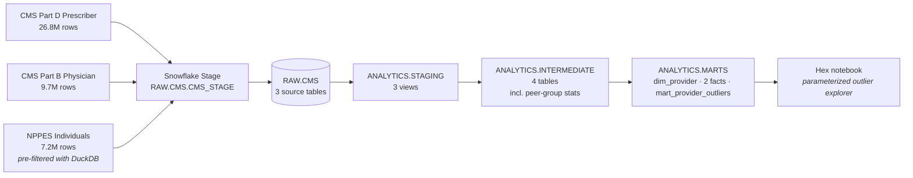

# CMS Medicare → Snowflake → dbt → Hex

> Provider cost & volume outlier detection across CMS Part D, Part B, and NPPES — modeled in dbt on Snowflake, surfaced via an interactive Hex notebook.

A 3-week portfolio sprint demonstrating an end-to-end modern data stack workflow on a real, large public dataset (43.7M source rows across three CMS files).

## Headline finding

Of **7.21M unique providers** in the union of NPPES individuals + Part D prescribers + Part B physicians, the marts flag:

- **5.20% (374,805)** as outliers via the robust **MAD method** within their (specialty × state) peer group
- **1.97% (142,023)** via the classical z-score method (more conservative — pulled by extreme tails)

The MAD method's sensitivity to right-skewed Medicare cost distributions is the project's intended workhorse. Top individual outlier in 2023: an Emergency Medicine physician in California with **$160M in Part D drug cost** vs a peer-group median of **$710** — a modified-z of 214,234.

## Stack

| Layer | Tool | Notes |
|---|---|---|
| Source files | CMS Provider Data Catalog + NPPES Registry | Public domain, no DUA |
| Warehouse | Snowflake (free trial) | XS warehouse, 60s auto-suspend |
| Auth | RSA key-pair | MFA-exempt; CI-portable |
| Transformation | dbt Core 1.11 on Python 3.13 | dbt-snowflake 1.11.4 |
| BI / notebook | Hex (Hobby tier) | Snowflake-native connector |
| Docs | `dbt docs generate` (local) | GitHub Pages publishing planned |
| Tests | 41 dbt schema tests | All green |

## Architecture



## DAG numbers

| Layer | Models | Build time | Tests |
|---|---|---|---|
| Staging | 3 views | < 5s | 14 |
| Intermediate | 4 tables | 38s | 12 |
| Marts | 4 tables | 18s | 15 |
| **Total** | **11 models** | **~60s** | **41 / 41 passing** |

## Repo layout

```
.
├── setup/                              # One-time Snowflake bootstrap
│   ├── 01_snowflake_setup.sql          # Warehouse, dbs, ANALYST role, grants
│   ├── 02_filter_nppes.py              # DuckDB pre-filter (11.4 GB → 647 MB)
│   ├── 03_load_to_snowflake.py         # Stage + COPY INTO via Python connector
│   └── 04_validate_counts.sql          # Post-load row-count + null sanity
├── models/
│   ├── _sources.yml                    # 3 RAW.CMS sources, freshness windows
│   ├── staging/                        # snake_case cast of each source
│   ├── intermediate/                   # provider rollups + peer-group stats
│   └── marts/                          # dim, facts, mart_provider_outliers
├── seeds/                              # Reference data
├── tests/                              # Singular tests (none yet)
├── macros/                             # Reusable Jinja
└── docs/
    ├── data_sources.md                 # URLs, sizes, license, grain per source
    └── auth_setup.md                   # RSA keygen + ALTER USER walkthrough
```

## Reproduce

1. **Snowflake trial** — [signup.snowflake.com](https://signup.snowflake.com/) (no credit card, $400 / 30 days)
2. **Snowsight** — paste & **select-all-then-Run** [`setup/01_snowflake_setup.sql`](./setup/01_snowflake_setup.sql) as `ACCOUNTADMIN`
3. **Local Python**
   ```bash
   python3.13 -m venv .venv && source .venv/bin/activate
   pip install -r requirements.txt
   ```
4. **Auth** — generate RSA key + `ALTER USER ... SET RSA_PUBLIC_KEY` per [`docs/auth_setup.md`](./docs/auth_setup.md), then drop your account locator + username into `~/.dbt/profiles.yml` (template at [`profiles.yml.example`](./profiles.yml.example))
5. **Verify** — `dbt debug` returns "All checks passed!"
6. **Source data** — follow [`setup/README.md`](./setup/README.md) to download the three CMS files and run `setup/02_filter_nppes.py` + `setup/03_load_to_snowflake.py`
7. **Build** — `dbt deps && dbt build` (~60s)
8. **Docs** — `dbt docs generate && dbt docs serve` opens the lineage graph on `localhost:8080`

## Methodology — provider outliers

Providers are scored within (specialty × state) peer groups on six metrics:

- **Part D**: total drug cost, total claims, brand-cost share, avg cost/claim
- **Part B**: total Medicare payment, total services

For each metric we compute **both** statistics:

- Classical **z-score**: `(x - mean) / stddev`, threshold `|z| ≥ 2.0`
- **Modified z-score** (MAD): `0.6745 × (x - median) / MAD`, threshold `|MAD-z| ≥ 3.5` ([Iglewicz & Hoaglin](https://www.itl.nist.gov/div898/handbook/eda/section3/eda35h.htm))

Why both: Medicare cost distributions are heavily right-skewed (a few mega-prescribers per peer group). Classical z-score is pulled toward those tails — its threshold becomes hard to clear, missing genuine outliers. MAD/median is robust to that. The mart exposes both so the Hex notebook can present the contrast.

**Peer-group floor of n ≥ 30** is enforced in `int_provider__peer_group_stats`. Smaller groups produce noisy MAD/stddev that flag too aggressively.

A composite **`is_outlier_any_mad`** flag fires if ANY of the six metrics flags via the MAD method — that's the default narrative in the Hex notebook. **`is_outlier_any_zscore`** is the conservative counterpart.

## What's next

- [x] All four model layers built, 41 tests passing
- [x] Real-data sanity check on outlier flagging
- [ ] Hex notebook — KPI overview, parameterized outlier table, provider drill-down, geographic choropleth
- [ ] dbt docs published to GitHub Pages (CI + repo secret for the Snowflake key)
- [ ] Loom walkthrough (5–7 min)
- [ ] Methodology refinement: tighter peer groups for huge specialties (e.g., Internal Medicine has 116k providers — 45% flag rate suggests sub-grouping is warranted)
