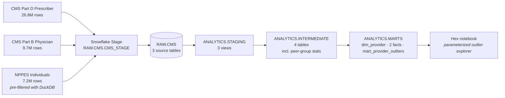

# CMS Medicare → Snowflake → dbt → Hex

> Provider cost & volume outlier detection across CMS Part D, Part B, and NPPES — modeled in dbt on Snowflake, surfaced via an interactive Hex notebook.

A 3-week portfolio sprint demonstrating an end-to-end modern data stack workflow on a real, large public dataset (43.7M source rows across three CMS files).

📚 **Live dbt docs: [kristenmartino.github.io/medicare-provider-outliers](https://kristenmartino.github.io/medicare-provider-outliers/)** — interactive lineage graph, model SQL, schema docs, and test coverage.

📝 **Reading order if you only have 5 minutes:** [`docs/findings.md`](./docs/findings.md) → this README → [`docs/methodology.md`](./docs/methodology.md).

## Headline finding

Of **7.06M providers** with sufficient NPPES coverage for peer benchmarking (`(taxonomy_code × state)` peer groups, n ≥ 30), the marts flag:

- **5.37% (379,048)** as outliers via the robust **MAD method**
- **2.08% (146,852)** via the classical z-score method (conservative — pulled by the same extreme tails it's trying to detect)

The MAD method's sensitivity to right-skewed Medicare cost distributions is the project's intended workhorse. Top individual outlier in 2023: **Rushdi Alul** (Emergency Medicine, IL) with **$84M in Part D drug cost** vs an Emergency-Medicine-in-IL peer-group median of **$577** — a modified-z of 134,510.

**Peer-group granularity matters.** A first cut used the broad CMS Medicare specialty text and lumped 116k providers under "Internal Medicine." The current build keys peer groups on NPPES `primary_taxonomy_code` (865 NUCC codes), splitting Internal Medicine into 28 subspecialties with median Part D drug costs ranging from **$5k (Sports Medicine IM)** to **$1.1M (Hematology & Oncology)** — clearly different prescribing populations that shouldn't be compared head-to-head.

## Stack

| Layer | Tool | Notes |
|---|---|---|
| Source files | CMS Provider Data Catalog + NPPES Registry | Public domain, no DUA |
| Warehouse | Snowflake (free trial) | XS warehouse, 60s auto-suspend |
| Auth | RSA key-pair | MFA-exempt; CI-portable |
| Transformation | dbt Core 1.11 on Python 3.13 | dbt-snowflake 1.11.4 |
| BI / notebook | Hex (Hobby tier) | Snowflake-native connector |
| Docs | `dbt docs generate` (local) | GitHub Pages publishing planned |
| Tests | 41 dbt schema tests | All green |

## Architecture



## DAG numbers

| Layer | Models | Build time | Tests |
|---|---|---|---|
| Seeds | 1 (NUCC taxonomy) | ~2s | 4 |
| Staging | 3 views | < 5s | 14 |
| Intermediate | 4 tables | 25s | 13 |
| Marts | 4 tables | 18s | 19 |
| **Total** | **11 models + 1 seed** | **~55s** | **56 / 56 passing** |

Validated on every push via the `.github/workflows/dbt-ci.yml` workflow (offline `dbt parse` — no warehouse credentials needed).

## Repo layout

```
.
├── setup/                              # One-time Snowflake bootstrap
│   ├── 01_snowflake_setup.sql          # Warehouse, dbs, ANALYST role, grants
│   ├── 02_filter_nppes.py              # DuckDB pre-filter (11.4 GB → 647 MB)
│   ├── 03_load_to_snowflake.py         # Stage + COPY INTO via Python connector
│   └── 04_validate_counts.sql          # Post-load row-count + null sanity
├── models/
│   ├── _sources.yml                    # 3 RAW.CMS sources, freshness windows
│   ├── staging/                        # snake_case cast of each source
│   ├── intermediate/                   # provider rollups + peer-group stats
│   └── marts/                          # dim, facts, mart_provider_outliers
├── seeds/                              # Reference data
├── tests/                              # Singular tests (none yet)
├── macros/                             # Reusable Jinja
└── docs/
    ├── data_sources.md                 # URLs, sizes, license, grain per source
    └── auth_setup.md                   # RSA keygen + ALTER USER walkthrough
```

## Reproduce

1. **Snowflake trial** — [signup.snowflake.com](https://signup.snowflake.com/) (no credit card, $400 / 30 days)
2. **Snowsight** — paste & **select-all-then-Run** [`setup/01_snowflake_setup.sql`](./setup/01_snowflake_setup.sql) as `ACCOUNTADMIN`
3. **Local Python**
   ```bash
   python3.13 -m venv .venv && source .venv/bin/activate
   pip install -r requirements.txt
   ```
4. **Auth** — generate RSA key + `ALTER USER ... SET RSA_PUBLIC_KEY` per [`docs/auth_setup.md`](./docs/auth_setup.md), then drop your account locator + username into `~/.dbt/profiles.yml` (template at [`profiles.yml.example`](./profiles.yml.example))
5. **Verify** — `dbt debug` returns "All checks passed!"
6. **Source data** — follow [`setup/README.md`](./setup/README.md) to download the three CMS files and run `setup/02_filter_nppes.py` + `setup/03_load_to_snowflake.py`
7. **Build** — `dbt deps && dbt build` (~60s)
8. **Docs locally** — `dbt docs generate && dbt docs serve` opens the lineage graph on `localhost:8080`
9. **Republish to GH Pages** — `./scripts/build_docs.sh` regenerates `docs/index.html`; commit + push to update [the public site](https://kristenmartino.github.io/medicare-provider-outliers/)

## Methodology — provider outliers

Providers are scored within **(taxonomy_code × state)** peer groups on six metrics. Peer-group key uses NPPES primary taxonomy code (mapped to NUCC display names via the [`nucc_taxonomy`](./seeds/nucc_taxonomy.csv) seed) — 9,490 peer groups survive the n ≥ 30 floor.

- **Part D**: total drug cost, total claims, brand-cost share, avg cost/claim
- **Part B**: total Medicare payment, total services

For each metric we compute **both** statistics:

- Classical **z-score**: `(x - mean) / stddev`, threshold `|z| ≥ 2.0`
- **Modified z-score** (MAD): `0.6745 × (x - median) / MAD`, threshold `|MAD-z| ≥ 3.5` ([Iglewicz & Hoaglin](https://www.itl.nist.gov/div898/handbook/eda/section3/eda35h.htm))

Why both: Medicare cost distributions are heavily right-skewed (a few mega-prescribers per peer group). Classical z-score is pulled toward those tails — its threshold becomes hard to clear, missing genuine outliers. MAD/median is robust to that. The mart exposes both so the Hex notebook can present the contrast.

**Peer-group floor of n ≥ 30** is enforced in `int_provider__peer_group_stats`. Smaller groups produce noisy MAD/stddev that flag too aggressively.

A composite **`is_outlier_any_mad`** flag fires if ANY of the six metrics flags via the MAD method — that's the default narrative in the Hex notebook. **`is_outlier_any_zscore`** is the conservative counterpart.

## What's next

- [x] All four model layers built, 56 tests passing
- [x] Methodology refinement (NPPES taxonomy peer groups; Internal Medicine 45% → 32%)
- [x] CI workflow: offline `dbt parse` on every push
- [x] dbt docs published to GitHub Pages — served from `docs/index.html`, regenerated via `./scripts/build_docs.sh`
- [x] Methodology doc + ad-hoc analyses (`docs/methodology.md`, `analyses/*.sql`)
- [ ] Hex notebook — KPI overview, parameterized outlier table, provider drill-down, geographic choropleth
- [ ] Loom walkthrough (5–7 min)
