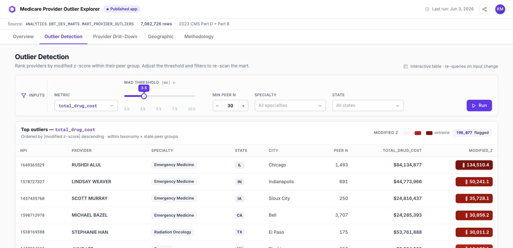
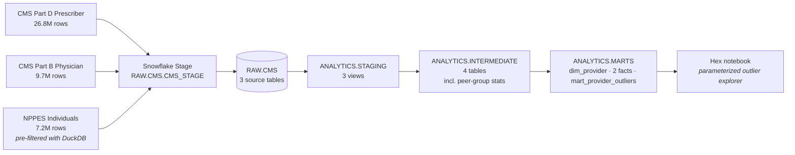

# CMS Medicare → Snowflake → dbt → Hex

> Provider cost & volume outlier detection across CMS Part D, Part B, and NPPES — modeled in dbt on Snowflake, surfaced via an interactive Hex notebook.

A 3-week portfolio sprint demonstrating an end-to-end modern data stack workflow on a real, large public dataset (43.7M source rows across three CMS files).

📚 **Live dbt docs: [kristenmartino.github.io/medicare-provider-outliers](https://kristenmartino.github.io/medicare-provider-outliers/)** — interactive lineage graph, model SQL, schema docs, and test coverage.

🔎 **Live data app: [/app](https://kristenmartino.github.io/medicare-provider-outliers/app/)** — interactive outlier explorer: KPIs, a metric-parameterized ranked table, provider drill-down, a state choropleth, and methodology. Built with [Evidence](https://evidence.dev) (BI-as-code: SQL + Markdown → static site), served from committed extracts so it needs no live warehouse.

📝 **Reading order if you only have 5 minutes:** [`docs/findings.md`](./docs/findings.md) → this README → [`docs/methodology.md`](./docs/methodology.md).



> The **Hex "Outlier Detection" tab** — a metric-parameterized, MAD-threshold-driven ranked table over the 7.06M-row mart, with per-metric peer-coverage gating. *High-fidelity mockup; the full five-tab set (Overview · Outlier Detection · Drill-Down · Geographic · Methodology) is in [`mockups/hex_dashboard/`](./mockups/hex_dashboard/).*

## Headline finding

Of **7.06M providers** with sufficient NPPES coverage for peer benchmarking (`(taxonomy_code × state)` peer groups, n ≥ 30), the marts flag:

- **5.23% (369,200)** as outliers via the robust **MAD method**
- **2.01% (141,766)** via the classical z-score method (conservative — pulled by the same extreme tails it's trying to detect)

The MAD method's sensitivity to right-skewed Medicare cost distributions is the project's intended workhorse. Top individual outlier in 2023: **Rushdi Alul** (Emergency Medicine, IL) with **$84M in Part D drug cost** vs an Emergency-Medicine-in-IL peer-group median of **$577** — a modified-z of 134,510.

> **"Outlier" is a statistical descriptor, not an allegation.** Every name in this dataset is from the public NPPES registry; every dollar figure is from the public CMS Provider Data Catalog. Defensible patterns (facility-level prescribing aggregated to an attending NPI, sub-specialists in generic taxonomies, oncology panels) produce extreme scores. See [`docs/disclaimer.md`](./docs/disclaimer.md).

**Peer-group granularity matters.** A first cut used the broad CMS Medicare specialty text and lumped 116k providers under "Internal Medicine." The current build keys peer groups on NPPES `primary_taxonomy_code` (865 NUCC codes), splitting Internal Medicine into 28 subspecialties with median Part D drug costs ranging from **$5k (Sports Medicine IM)** to **$1.1M (Hematology & Oncology)** — clearly different prescribing populations that shouldn't be compared head-to-head.

## Stack

| Layer | Tool | Notes |
|---|---|---|
| Source files | CMS Provider Data Catalog + NPPES Registry | Public domain, no DUA |
| Warehouse | Snowflake (free trial) | XS warehouse, 60s auto-suspend |
| Auth | RSA key-pair | MFA-exempt; CI-portable |
| Transformation | dbt Core 1.11 on Python 3.13 | dbt-snowflake 1.11.4 |
| BI / notebook | Hex (Hobby tier) | Snowflake-native connector |
| Docs | dbt docs static site | [Live on GitHub Pages](https://kristenmartino.github.io/medicare-provider-outliers/), regenerated via `./scripts/build_docs.sh` |
| Tests | 59 dbt tests (53 schema + 3 singular + 3 unit) | All green |
| CI | GitHub Actions, offline `dbt parse` | Catches SQL / ref / source breaks without needing warehouse creds in repo secrets |

## Architecture



## DAG numbers

| Layer | Models | Build time | Tests |
|---|---|---|---|
| Seeds | 1 (NUCC taxonomy) | ~2s | 3 |
| Staging | 3 views | < 5s | 14 |
| Intermediate | 4 tables | 25s | 17 |
| Marts | 4 tables | 18s | 19 |
| **Total** | **11 models + 1 seed + 3 analyses** | **~55s** | **59 / 59 passing** (53 schema + 3 singular + 3 unit) |

Validated on every push via [`.github/workflows/dbt-ci.yml`](./.github/workflows/dbt-ci.yml). The workflow runs `dbt parse` offline against a stub profile — no Snowflake credentials live in repo secrets. This catches SQL syntax errors, broken `{{ ref }}` / `{{ source }}` lookups, and stale schema-yml columns before they ever hit the warehouse; running real tests in CI would require provisioning a CI-scoped Snowflake user with key-pair auth, which is the right next step once the project leaves portfolio mode.

## Repo layout

```
.
├── .github/workflows/
│   └── dbt-ci.yml                      # Offline `dbt parse` on every push
├── setup/                              # One-time Snowflake bootstrap
│   ├── 01_snowflake_setup.sql          # Warehouse, dbs, ANALYST role, grants
│   ├── 02_filter_nppes.py              # DuckDB pre-filter (11.4 GB → ~1.5 GB)
│   ├── 03_load_to_snowflake.py         # Stage + COPY INTO via Python connector
│   ├── 04_validate_counts.sql          # Post-load row-count + null sanity
│   └── 05_credit_usage.sql             # Trial credit burn + runway (ACCOUNTADMIN)
├── models/
│   ├── _sources.yml                    # 3 RAW.CMS sources, freshness windows
│   ├── staging/                        # snake_case cast of each source
│   ├── intermediate/                   # provider rollups + peer-group stats
│   └── marts/                          # dim, facts, mart_provider_outliers
├── seeds/
│   └── nucc_taxonomy.csv               # NUCC taxonomy → display-name mapping
├── tests/                              # Singular tests for business invariants
│   ├── assert_brand_cost_share_within_unit_interval.sql
│   ├── assert_mart_peer_group_floor_holds.sql
│   └── assert_mart_outlier_rate_within_reason.sql
├── macros/
│   └── outlier_detection.sql           # zscore, modified_zscore, is_outlier
├── analyses/                           # Ad-hoc SQL examples over the marts
│   ├── top_outliers.sql
│   ├── peer_group_diagnostics.sql
│   └── brand_share_opportunity.sql
├── scripts/
│   └── build_docs.sh                   # `dbt docs generate --static` → docs/index.html
└── docs/                               # Portfolio narrative + static dbt-docs site
    ├── findings.md                     # 5 analytical findings with reproducible SQL
    ├── methodology.md                  # Peer-group key, z vs MAD, threshold rationale
    ├── disclaimer.md                   # "Outlier ≠ allegation"; public-data framing
    ├── data_sources.md                 # URLs, sizes, license, grain per source
    ├── auth_setup.md                   # RSA keygen + ALTER USER walkthrough
    ├── hex_notebook_spec.md            # Tab-by-tab Hex build cheat-sheet
    └── index.html                      # Static dbt docs site served by GH Pages
```

## Reproduce

1. **Snowflake trial** — [signup.snowflake.com](https://signup.snowflake.com/) (no credit card, $400 / 30 days)
2. **Snowsight** — paste & **select-all-then-Run** [`setup/01_snowflake_setup.sql`](./setup/01_snowflake_setup.sql) as `ACCOUNTADMIN`
3. **Local Python**
   ```bash
   python3.13 -m venv .venv && source .venv/bin/activate
   pip install -r requirements.txt
   ```
4. **Auth** — generate RSA key + `ALTER USER ... SET RSA_PUBLIC_KEY` per [`docs/auth_setup.md`](./docs/auth_setup.md), then drop your account locator + username into `~/.dbt/profiles.yml` (template at [`profiles.yml.example`](./profiles.yml.example))
5. **Verify** — `dbt debug` returns "All checks passed!"
6. **Source data** — follow [`setup/README.md`](./setup/README.md) to download the three CMS files and run `setup/02_filter_nppes.py` + `setup/03_load_to_snowflake.py`
7. **Build** — `dbt deps && dbt build` (~60s)
8. **Docs locally** — `dbt docs generate && dbt docs serve` opens the lineage graph on `localhost:8080`
9. **Republish to GH Pages** — `./scripts/build_docs.sh` regenerates `docs/index.html`; commit + push to update [the public site](https://kristenmartino.github.io/medicare-provider-outliers/)

## Methodology — provider outliers

Providers are scored within **(taxonomy_code × state)** peer groups on six metrics. Peer-group key uses NPPES primary taxonomy code (mapped to NUCC display names via the [`nucc_taxonomy`](./seeds/nucc_taxonomy.csv) seed) — 9,490 peer groups survive the n ≥ 30 floor.

- **Part D**: total drug cost, total claims, brand-cost share, avg cost/claim
- **Part B**: total Medicare payment, total services

For each metric we compute **both** statistics:

- Classical **z-score**: `(x - mean) / stddev`, threshold `|z| ≥ 2.0`
- **Modified z-score** (MAD): `0.6745 × (x - median) / MAD`, threshold `|MAD-z| ≥ 3.5` ([Iglewicz & Hoaglin](https://www.itl.nist.gov/div898/handbook/eda/section3/eda35h.htm))

Why both: Medicare cost distributions are heavily right-skewed (a few mega-prescribers per peer group). Classical z-score is pulled toward those tails — its threshold becomes hard to clear, missing genuine outliers. MAD/median is robust to that. The mart exposes both so the Hex notebook can present the contrast.

**Peer-group floor of n ≥ 30** is enforced in `int_provider__peer_group_stats`. Smaller groups produce noisy MAD/stddev that flag too aggressively.

A composite **`is_outlier_any_mad`** flag fires if ANY of the six metrics flags via the MAD method — that's the default narrative in the Hex notebook. **`is_outlier_any_zscore`** is the conservative counterpart.

**Per-metric coverage gates.** A peer group can pass the `n_providers >= 30` union floor with only a handful of actual Part D prescribers, which would leave the Part D median computed over a thin subpopulation. The mart enforces an additional `peer_n_part_d >= 30` (and the analogous `peer_n_part_b`, `peer_n_brand_share`, `peer_n_avg_cost_per_claim`) at flag-computation time so a provider can never be flagged against a per-metric median with fewer than 30 observations. The counts are exposed in the mart so consumers can audit the denominator behind any flag.

## Who is this for?

The mart is built for three audiences, each of which would consume it differently:

- **Payer / state Medicaid integrity teams** treat `is_outlier_any_mad` as a *triage* signal — a candidate list to be combined with their own beneficiary-overlap, prescribing-relationship-graph, and on-the-ground audit tools. The per-metric peer coverage columns let them drop the noisy long tail (e.g., flags from peer groups under their internal coverage threshold).
- **Healthcare journalists / policy researchers** use the (specialty × state) ranked outlier table and the geographic state-level rollup to find leads worth investigating publicly. The disclaimer guides the framing.
- **Hex notebook users (the portfolio audience)** explore the parameterized table — sliding the MAD threshold, switching the metric, drilling from a state choropleth into a single provider's peer-comparison histogram — to understand how peer-group methodology choices change which providers get surfaced.

## Limitations

Reasons not to treat these flags as final answers:

- **Medicare fee-for-service only.** The CMS Provider Data Catalog covers FFS Parts B and D. Medicare Advantage (Part C) and Medicaid are entirely absent. A flagged provider whose patient panel skews Medicare Advantage is being benchmarked on a fragment of their actual practice.
- **One year (CY 2023).** No trend analysis — a provider whose 2023 spend doubled vs 2022 looks identical to a provider whose 2023 spend doubled three years ago. Multi-year requires re-running the loader against multiple `DY*` files; the schema supports it but the current marts are single-vintage.
- **Cell suppression.** CMS suppresses any (provider × drug) or (provider × HCPCS) cell with fewer than 11 beneficiaries. Low-volume providers will have systematically incomplete metric totals. Brand-vs-generic share for niche prescribers is particularly affected.
- **NPPES taxonomy is self-reported.** A meaningful share of NPIs declare a generic "physician" taxonomy when they're actually subspecialists, or never update their taxonomy after a fellowship. Peer groups inherit this noise — a sub-specialist tagged under general internal medicine will be benchmarked against generalists.
- **Provider attribution.** Many high-volume outliers (especially in Emergency Medicine) are facility-level prescribing aggregated to one attending NPI for billing purposes. The mart can't disentangle this without an external feature (share-of-facility-volume) we don't have. See `docs/findings.md` §1.
- **Not comparable to OIG / Medicare Fraud Strike Force methodologies.** Those use beneficiary-overlap, prescribing-relationship graphs, and pattern fingerprinting that aren't in this project. Outliers here are a triage list, not adjudicated targets.
- **No medical-appropriateness signal.** Cost and volume tell you nothing about whether a prescription pattern is clinically defensible. An oncologist treating a rare cancer panel will look extreme on every metric and that's the right call.

## What's next

- [x] All four model layers built, 59 tests passing (53 schema + 3 singular + 3 unit)
- [x] Methodology refinement (NPPES taxonomy peer groups; Internal Medicine 45% → 32%)
- [x] CI workflow: offline `dbt parse` on every push
- [x] dbt docs published to GitHub Pages — served from `docs/index.html`, regenerated via `./scripts/build_docs.sh`
- [x] Methodology doc + ad-hoc analyses (`docs/methodology.md`, `analyses/*.sql`)
- [ ] Hex notebook — KPI overview, parameterized outlier table, provider drill-down, geographic choropleth. Tab-by-tab SQL cheat-sheet at [`docs/hex_notebook_spec.md`](./docs/hex_notebook_spec.md); high-fidelity five-tab mockup at [`mockups/hex_dashboard/`](./mockups/hex_dashboard/) (live publish pending).
- [ ] Loom walkthrough (5–7 min)
